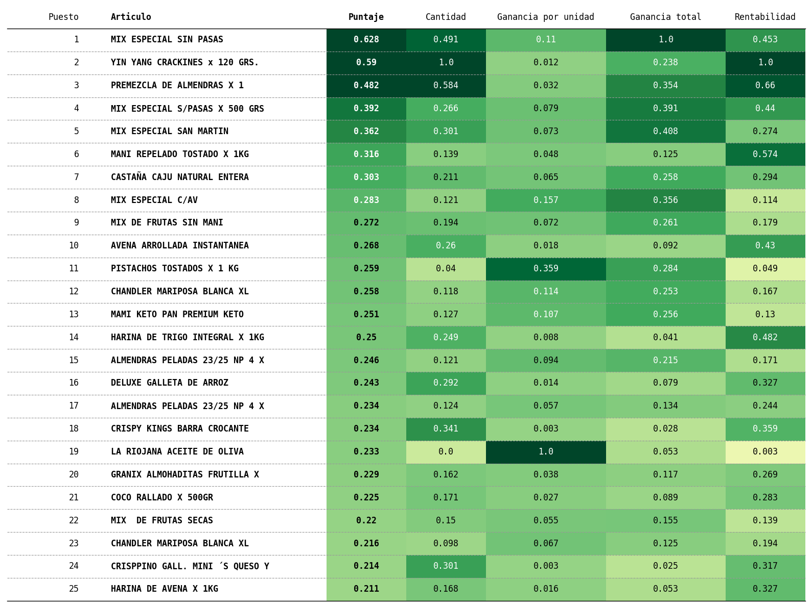
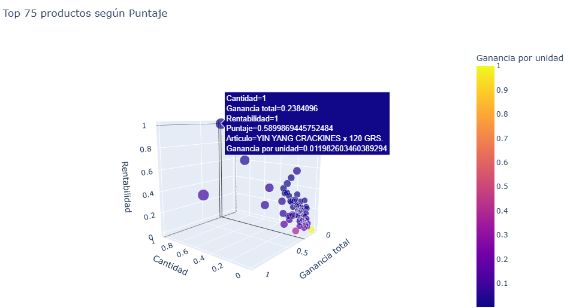

# Ranking de productos por puntaje

La siguiente visualización muestra un ranking de productos basado en un puntaje compuesto, calculado a partir de múltiples variables de desempeño comercial.

El objetivo de este indicador es identificar los productos más convenientes para el negocio, considerando no solo cuánto se venden, sino también su rentabilidad.

El puntaje se calcula combinando:

Cantidad vendida 
Ganancia por unidad 
Ganancia total 
Rentabilidad 

La tabla muestra los productos ordenados por este puntaje global.

# Visualización tridimensional del desempeño

Debajo se muestra un gráfico 3D de los 75 productos con mayor puntaje, donde:

Eje X: Ganancia total
Eje Y: Cantidad vendida
Eje Z: Rentabilidad
Color: Ganancia por unidad

Este gráfico permite observar cómo se posicionan los productos en términos de volumen de ventas y rentabilidad, ayudando a identificar:

productos muy vendidos pero poco rentables
productos con alto margen pero baja rotación
productos óptimos (alto margen y alta venta) 
